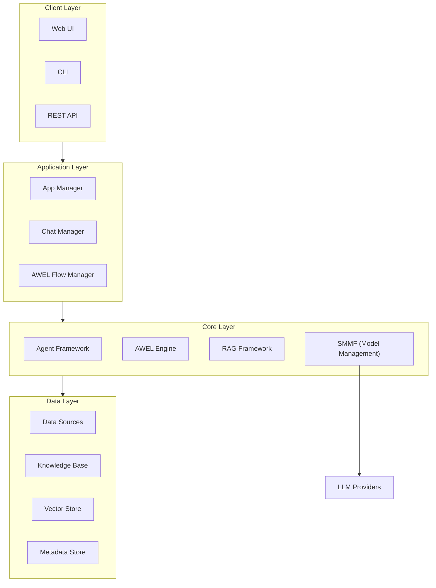
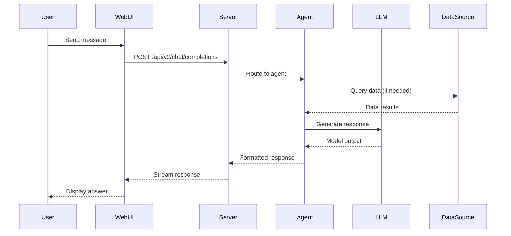

# Architecture

An overview of how DB-GPT is structured and how its components fit together.

## High-level view



## Package structure

DB-GPT is a Python monorepo organized into multiple packages under `packages/`:

| Package | Purpose |
|---|---|
| **dbgpt-core** | Core abstractions: agent, AWEL, RAG, model interfaces, storage |
| **dbgpt-app** | Application server, chat logic, Web API endpoints |
| **dbgpt-serve** | Service modules (knowledge, flow, app, datasource management) |
| **dbgpt-ext** | Extensions: datasource connectors, storage backends, model providers |
| **dbgpt-client** | Python client SDK for the DB-GPT REST API |
| **dbgpt-accelerator** | GPU acceleration utilities (quantization, inference optimization) |

```
DB-GPT/
├── packages/
│   ├── dbgpt-core/        # Core abstractions
│   ├── dbgpt-app/         # Application server
│   ├── dbgpt-serve/       # Service modules
│   ├── dbgpt-ext/         # Extensions
│   ├── dbgpt-client/      # Python client SDK
│   └── dbgpt-accelerator/ # GPU acceleration
├── web/                   # Next.js Web UI
├── configs/               # TOML configuration files
└── docs/                  # Documentation (Docusaurus)
```

## Core subsystems

### SMMF (Service-oriented Multi-Model Management Framework)

Manages multiple LLM and embedding model instances. Supports:

- API proxy models (OpenAI, DeepSeek, Qwen, etc.)
- Local models via HuggingFace Transformers, vLLM, llama.cpp
- Model switching and failover
- Standalone and cluster deployment modes

Learn more: [SMMF Concept](/docs/getting-started/concepts/smmf) | [SMMF Module](/docs/modules/smmf)

### AWEL (Agentic Workflow Expression Language)

A domain-specific language for building AI application workflows as directed acyclic graphs (DAGs). AWEL provides:

- Operators: Map, Reduce, Join, Branch, Stream transformers
- Triggers: HTTP, scheduler-based
- Visual editor: AWEL Flow in the Web UI

Learn more: [AWEL Concept](/docs/getting-started/concepts/awel) | [AWEL Tutorial](/docs/awel/tutorial)

### Agent Framework

Data-driven multi-agent system with:

- **Profile**: Agent identity and role definition
- **Memory**: Sensory, short-term, long-term, and hybrid memory
- **Planning**: Task decomposition and execution strategies
- **Action**: Tool invocation and result processing
- **Resource**: Tools, databases, knowledge bases, and resource packs

Learn more: [Agents Concept](/docs/getting-started/concepts/agents) | [Agent Guide](/docs/agents/introduction/)

### RAG Framework

Retrieval-Augmented Generation with multiple retrieval strategies:

- Vector similarity search (ChromaDB, Milvus, OceanBase)
- Knowledge graph retrieval (Graph RAG)
- Keyword-based retrieval (BM25)
- Hybrid retrieval combining multiple strategies

Learn more: [RAG Concept](/docs/getting-started/concepts/rag) | [RAG Module](/docs/modules/rag)

## Configuration

DB-GPT uses TOML configuration files in the `configs/` directory:

```toml
# configs/dbgpt-proxy-openai.toml
[models]
[[models.llms]]
name = "chatgpt_proxyllm"
provider = "proxy/openai"
api_key = "your-api-key"

[[models.embeddings]]
name = "text-embedding-3-small"
provider = "proxy/openai"
api_key = "your-api-key"
```

Full reference: [Config Reference](/docs/config/config-reference)

## Data flow

A typical chat request flows through DB-GPT like this:



## What's next

- [AWEL](/docs/getting-started/concepts/awel) — Understand workflow orchestration
- [Agents](/docs/getting-started/concepts/agents) — Learn about the agent framework
- [Model Providers](/docs/getting-started/providers/) — Configure your preferred LLM
